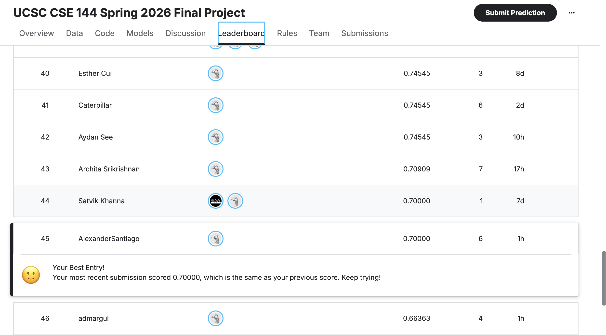

CSE144 Final Project

100-class image classification (ViT-B/16)

Setup:
  python -m venv venv
  source venv/bin/activate
  pip install -r requirements.txt

Data:
  data/train/   labeled training images (class folders 0–99)
  data/test/    unlabeled Kaggle test images

Training:
  Trains ViTB16Classifier on all of data/train/.
  Saves the best checkpoint to ./checkpoints/best_vit_b16.pt

  **80/20 split**
  When testing models instead of always submitting to Kaggle for the test score. I created a 80/20 split for training
  and validation. The validation accuracy was noisy but gave a good reference towards model improvement. Before the final
  Kaggle submission I trained on the entire training data set then submitted my prediction.

  COMMANDS:

  source venv/bin/activate

  PYTHONPATH=src python src/train.py

Inference:
  Loads ./checkpoints/best_vit_b16.pt, predicts on data/test/,
  and writes ./submission.csv for Kaggle.

  COMMANDS:
  
  source venv/bin/activate

  PYTHONPATH=src python src/inference.py

Model:
  src/model.py — ViTB16Classifier (pretrained ViT-B/16, fine-tuned head)

Kaggle leader-board placement

